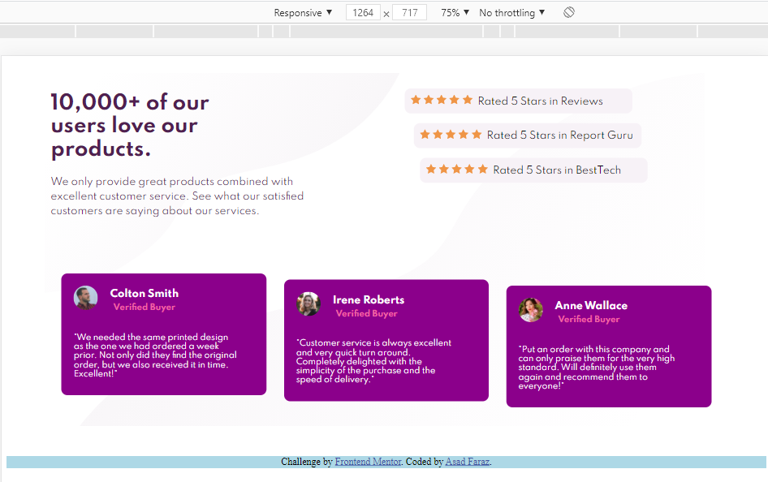
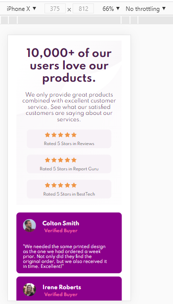
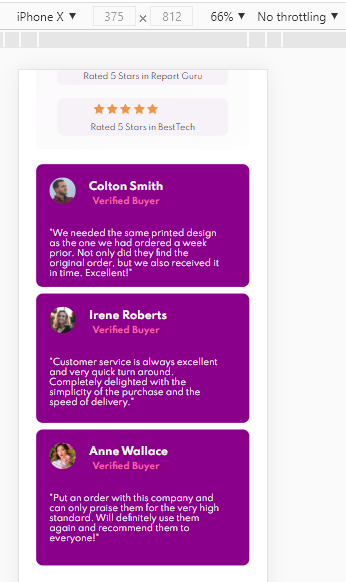

This website is a challenge from Frontend Mentor and I created this.

It is a complete responsive website.

Tools that are used are:

- HTML
- CSS
- Grid Layout
- Flexbox
- Media Queries

You can find more screenshots in the screenshots directory.

I am learning grid so this is my first time to create a webpage using grids.
I am not good at grids yet but I can do it much better using only flexbox. But its okay I just give Grid
layout a try and it looks like pretty much success!
